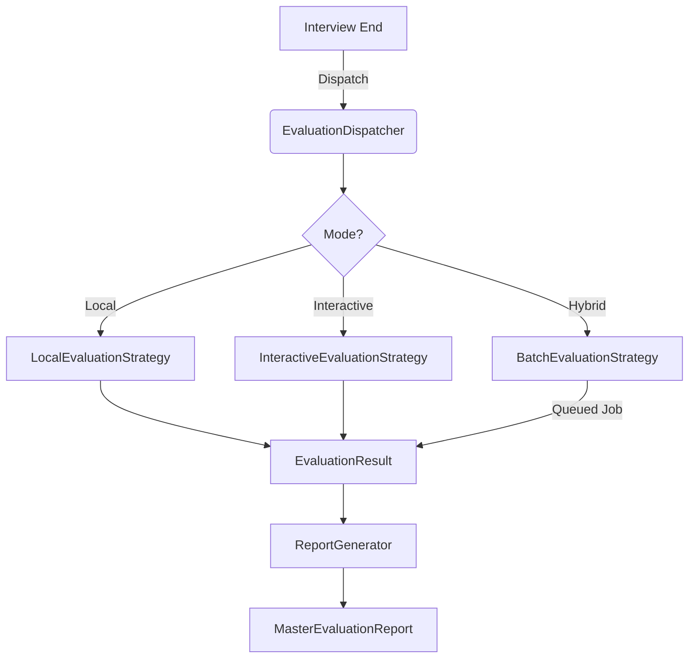

# Evaluation Architecture V2

## Overview
The V2 Evaluation Architecture provides a scalable, determinable, and reproducible system for analyzing candidate responses during technical interviews. It strictly enforces separation of concerns between the interview lifecycle (domain logic) and evaluation processing (engines).

## Core Principles
1. **Immutable Results**: Evaluations are pure data. Once an engine scores an answer, the output is frozen.
2. **Strategy Pattern**: The application relies on `EvaluationStrategy`. It never directly instantiates an API call or local heuristic without going through the dispatcher.
3. **Data Versioning**: Every report snapshots the pipeline version, rubric version, and model version, preventing the "digital crime scene" problem.

## High-Level Flow

## Key Components
- **`EvaluationDispatcher`**: The single entry point. Reads the session mode and delegates to the appropriate strategy.
- **`EvaluationContext`**: The standardized input for all strategies.
- **`EvaluationCore`**: The deterministic heuristic pipeline powering Local Mode.
